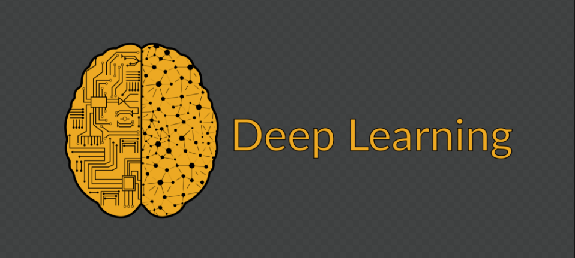

# Udacity Deep Learning Nanodegree Projects
**My projects for the Udacity Deep Learning Nanodegree Program**
  

# Overview
Deep learning is the hottest topic when thinking about artificial intelligence. The largest technology companies in the world, such as Amazon, Google, IBM and Facebook, are best known for using this technology. Search and voice commands, image recognition and search, and automatic translation tools for posts on social networks are common examples that currently use deep learning. But what is yet to come is much greater. Get ready for this revolution in the world of artificial intelligence with Udacity!
 
## Project 1
### Your first neural network
In this project, you'll get to build a neural network from scratch to carry out a prediction problem on a real dataset! By building a neural network from the ground up, you'll have a much better understanding of gradient descent, backpropagation, and other concepts that are important to know before we move to higher level tools such as Tensorflow. You'll also get to see how to apply these networks to solve real prediction problems!
 
## Project 2
### Dog Breed Classifier
Welcome to the Convolutional Neural Networks (CNN) project! In this project, you will learn how to build a pipeline to process real-world, user-supplied images. Given an image of a dog, your algorithm will identify an estimate of the canine’s breed. If supplied an image of a human, the code will identify the resembling dog breed. 

Along with exploring state-of-the-art CNN models for classification, you will make important design decisions about the user experience for your app. Our goal is that by completing this lab, you understand the challenges involved in piecing together a series of models designed to perform various tasks in a data processing pipeline. Each model has its strengths and weaknesses, and engineering a real-world application often involves solving many problems without a perfect answer. Your imperfect solution will nonetheless create a fun user experience!
 
## Project 3
### Generate TV Scripts
In this project, you'll generate your own Simpsons TV scripts using RNNs. You'll be using part of the Simpsons dataset of scripts from 27 seasons. The Neural Network you'll build will generate a new TV script for a scene at Moe's Tavern.
 
## Project 4
### Generate Faces
In this project, you'll use generative adversarial networks to generate new images of faces.
 
## Project 5
### Teach a Quadcopter How to Fly
The Quadcopter or Quadrotor Helicopter is becoming an increasingly popular aircraft for both personal and professional use. Its maneuverability lends itself to many applications, from last-mile delivery to cinematography, from acrobatics to search-and-rescue. 

Most quadcopters have 4 motors to provide thrust, although some other models with 6 or 8 motors are also sometimes referred to as quadcopters. Multiple points of thrust with the center of gravity in the middle improves stability and enables a variety of flying behaviors. 

But it also comes at a price–the high complexity of controlling such an aircraft makes it almost impossible to manually control each individual motor's thrust. So, most commercial quadcopters try to simplify the flying controls by accepting a single thrust magnitude and yaw/pitch/roll controls, making it much more intuitive and fun. 

The next step in this evolution is to enable quadcopters to autonomously achieve desired control behaviors such as takeoff and landing. You could design these controls with a classic approach (say, by implementing PID controllers). Or, you can use reinforcement learning to build agents that can learn these behaviors on their own. This is what you are going to do in this project!
